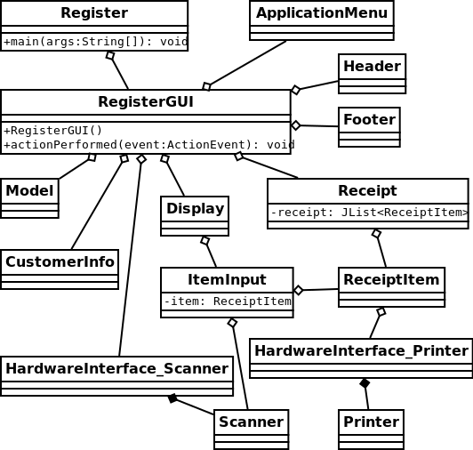

# Register

This program is a demonstration of an end-user software system I designed and programmed. This system provides a cash register interface for the cashier. 

### Running the Program

To compile this program, run `gradle build` from the root of this project. To run, `java -jar build/libs/register.jar` from the root of this project. 

This project has been documented in javadoc style; run `gradle javadoc` to generate the HTML.

### Features

- Inputting items manually (hardware isn't an option).
  -   An interface may be provided for your own hardware input, but you have to write your own code to run your hardware.
- A small database of items has been provided.

- Changing the price, quantity, or name of an item on the receipt.
- Deleting receipt items.
- Printing or emailing receipts (an interface will be provided; the implementation will not).
- Customer accounts (for store member discounts, for email spam, etc).
- Coupon input.

Some other possibilities:

- A login system (for distinguishing between cashiers and managers).

- Manager overrides.

### Notable code aspects:

- Low coupling:

The parts of the GUI are completely modular. Any part of the GUI (such as the header, footer, receipt list, etc) can be replaced easily, although it must provide an implementation of certain functions, go figure. Replacing a sub-gui class should not affect any other part of the program. A basic class diagram has been provided below.

Note that the Display class is still a work in progress (as is the entire project...), so the diagram may be a bit different than the future implementation.

- High cohesion:

Each class has a very specific purpose and it does it well. All parts of that class work together for a single goal. 

- Dependency injection:

The unit testing will utilize dependency injection for better testing. Because this project is far from complete, this is not too notable yet.

- Unit testing (Junit):

Unit testing will test the classes. As mentioned above, the classes are loosely coupled, so unit testing can be targeted and correct. 

- Travis CI

The Travis CI service is in use on this repository, running gradle and the unit tests. There's even a little build status icon at the top of this readme!

- MVC architecture:

This project utilizes the MVC architecture as much as it can. The main class (RegisterGUI) assembles the classes into the whole View, and provides the action listener, and thus is also the Controller. The Model class handles all major data manipulation as well as database interaction. 

-   Full Javadoc documentation

### What I Learned

-   Gradle (new)
-   Java GUI (mostly new)
-   Travis CI (new)
-   JUnit testing (mostly new)
-   Emacs registers (mostly new) (super awesome)
-   Which way those lines go in a UML diagram (I've learned this a thousand times, but still don't remember)